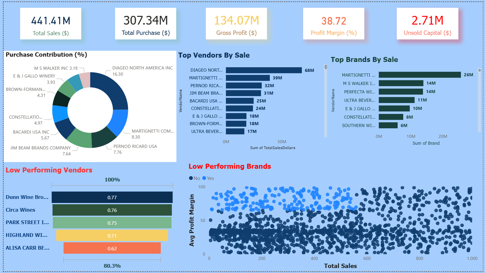

# Vendor_Performance_Data_Analytics
# Exploratory Data Analysis & Vendor Sales Summary

## Project Overview
This project focuses on transforming large-scale inventory, purchasing, and sales data into a consolidated **Vendor Sales Summary** to support data-driven decisions related to **vendor profitability, pricing optimization, and inventory efficiency**.

The analysis combines **Exploratory Data Analysis (EDA)**, **statistical testing**, **SQL-based data modeling**, and a **Power BI dashboard** to extract actionable business insights from raw transactional data.

---

## Data Source Overview
The data is sourced from the `inventory.db` database and consists of **7 relational tables** with more than **15 million total records**.

| Table Name | Key Contents | Purpose |
|-----------|-------------|---------|
| begin_inventory / end_inventory | On-hand quantity, prices | Track stock levels over time |
| purchases | Vendor, PO, date, purchase price | Analyze procurement cost |
| purchase_prices | Brand, standard price, volume | Market price reference |
| sales | Sales quantity, sales dollars, excise tax | Measure revenue and demand |
| vendor_invoice | Freight, PO number, totals | Freight and logistics costs |

---

## Data Consolidation Strategy
A master table named **`vendor_sales_summary`** was engineered using **SQL Common Table Expressions (CTEs)** to integrate purchasing, sales, pricing, and freight data.

### Key Metrics Calculated
- **Gross Profit** = Total Sales Dollars − Total Purchase Dollars  
- **Profit Margin** = Gross Profit / Total Sales Dollars  
- **Stock Turnover** = Total Sales Quantity / Total Purchase Quantity  
- **Sales-to-Purchase Ratio** = Revenue generated per dollar spent  

This approach avoids repeated joins on multimillion-row tables and enables efficient downstream analysis.

---

## Key Findings

### 🔹 Vendor Performance
- **Top Revenue Drivers**:  
  Vendors such as **BROWN-FORMAN CORP** and **MARTIGNETTI COMPANIES** dominate purchase and sales volumes  
- **Profitability Variance**:  
  Minimum Gross Profit observed: **–$52,002.78**, indicating loss-making products  
- **Freight Impact**:  
  Freight costs vary significantly (e.g., ~$68K for Brown-Forman), materially affecting net margins  

### 🔹 Inventory Efficiency
- High-volume products (e.g., *Absolut 80 Proof*) show turnover ratios near **1.0**, indicating efficient inventory flow
- Some vendors exhibit low turnover, signaling overstocking risk

---

## Technical Implementation
To ensure scalability and repeatability:

- **ETL Automation**: Python-based pipeline for extraction, transformation, and loading  
- **Data Cleaning**:
  - Standardized data types (e.g., volume → `float64`)
  - Filled missing values with zero
  - Removed string padding in categorical fields
- **Persistence**:
  - Final summary stored as `vendor_sales_summary` in the database

This design prevents expensive recomputation on large datasets.

---

## Statistical Analysis & Integrity

### Data Filtering
To ensure reliable statistical results:
- **Final Sample Size**: 8,564 brand–vendor combinations  
- **Filters Applied**:
  - GrossProfit > 0  
  - ProfitMargin > 0  
  - TotalSalesQuantity > 0  

---

## Vendor Concentration & Capital Exposure
- **Top 10 vendors account for 65.69% of total procurement**
- **Lead Vendor**:  
  **DIAGEO NORTH AMERICA INC**
  - Purchase Contribution: **16.3%**
  - Total Sales: **$67.99M**
  - Unsold Inventory Capital: **~$722K**

This highlights significant vendor dependency and working capital risk.

---

## Pricing Strategy & Bulk Purchasing
Bulk purchasing demonstrates strong cost advantages:

| Order Size | Avg Unit Price |
|-----------|---------------|
| Large Orders | ~$10.78 |
| Small Orders | ~$39.07 |

- **72% reduction in unit cost** for bulk orders
- Effective only when supported by high inventory turnover

---

## High Margin vs High Volume Insight
Statistical testing (Welch’s T-Test) revealed a significant margin difference:

| Vendor Group | Mean Profit Margin |
|-------------|-------------------|
| Low-Performing (Low Sales) | **41.57%** |
| High-Performing (High Sales) | **31.18%** |

- **P-Value**: 0.0000 → Null Hypothesis rejected  
- High-volume vendors operate on thinner margins to maintain market share  
- Low-volume vendors act as premium or niche brands  

---

## Inventory Efficiency & Risk
- **Correlation (Purchase vs Sales Quantity)**: **0.999**
- **Total Unsold Capital**: **$2.71M**
- **Slow-Moving Vendors**:
  - ALISA CARR BEVERAGES (Turnover: 0.61)
  - HIGHLAND WINE MERCHANTS LLC (Turnover: 0.70)

---

## Statistical Summary Highlights

### Negative & Zero Values
- Gross Profit minimum: **–$52,002.78**
- Profit Margin minimum: **–∞**
- Some products purchased but never sold

### Outliers
- Purchase Price max: **$5,681.81**
- Actual Price max: **$7,499.99**
- Freight Cost max: **$257,032.07**
- Stock Turnover range: **0 to 274.5**

### Correlation Insights
- PurchasePrice vs SalesDollars: **–0.012**
- PurchasePrice vs GrossProfit: **–0.016**
- ProfitMargin vs SalesPrice: **–0.179**
- StockTurnover vs ProfitMargin: **–0.055**

---

##  Actionable Recommendations

| Segment | Strategy | Action |
|-------|---------|-------|
| Top Vendors | Efficiency | Renegotiate freight & reduce locked capital |
| High Margin Brands | Promotion | Market 198 brands with margins >64% |
| Slow Movers | Liquidation | Markdown items with turnover <0.80 |
| Bulk Buyers | Optimization | Bulk buy only high-turnover A-category items |

---

##  Dashboard
An interactive **Power BI dashboard** was developed to visualize:
- Vendor sales performance
- Purchase concentration
- Profit margins
- Inventory turnover
- Capital lock-in by vendor
  

---

## Conclusion
This project demonstrates how **EDA, statistical validation, and operational KPIs** can be combined to derive meaningful business insights from large transactional datasets.

Key outcomes include:
- Identification of vendor dependency risks
- Validation of bulk purchasing effectiveness
- Clear segmentation between high-margin and high-volume vendors
- Actionable strategies to reduce **$2.71M** in locked inventory capital

By applying these insights, organizations can improve profitability, optimize pricing, and build a more resilient, data-driven procurement strategy.
